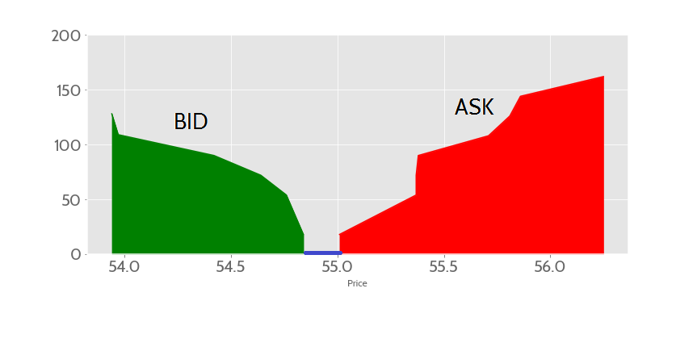

# Decentralized orderbook

SimpEX is a very simple decentralized exchange.

- Non-custodial: the assets are moved only when an order is executed.
- Manual Market Maker (MMM): as opposed to an Automated Market Maker (AMM), which meets bids via provided liquidity and price-oracle functions. 
- Fair: making and taking is equally priced.
- Sandwich-safe: frontrunning cannot modify market conditions such as price. 
  - Each 'take' uniquely identifies an order to take, thus cannot be swayed by MEV shenanigans.
  - The 'worst' a frontrunner can do is take the order before you do. 
-  Slippage-safe
  - A 'shallow orderbook' cannot cause slippage, since there's no automated fall-through to other orders.

## What is an exchange

Traditionally, an exchange for a given asset pair is an order-book. This is often visualized as two hills: the left side is buy-orders (bid), right side is sell-orders (ask). 
The "valley" between the two hills is "the spread", 
and traditional exchanges often use the spread to reward themselves, the makers, or (less often) the takers. 



Maker: someone who provides liquidity -- placing an order into the orderbook. 
Taker: someone who removes liquidity -- taking an order off the orderbook. 

This exchange earns money both from makers and takers: the cost for both making and taking an order is `1` native token. 

## How to use this

Very simple. 
1. Check what assets are defined, e.g. "TETH/UNI" is the asset exhange between Tether and Uniswap tokens. 
2. If you want to sell 100 Tether for 200 Uniswap tokens, then call 
 2a. approve the SimpDEX for transferring TETH
 2b. Place a 'make' order:
 
```
 	make(200 /*cost in UNI */, 100 /*amount of TETH to sell*/, false /*direction, SELL =false, BUY=true */, "TETH/UNI")
```

For someone who wants to take the order we just placed, it's equally simple: 

1. approve the SimpDEX for transferring UNI on your behalf
2. Take it:
 
```
 	take(orderid)
```
3. (optional): revoke the approval from step 1. 

And of course, before doing these operations you need to buy some SMP-tokens. 

